# 🏷️ YouTube Comments Sentiment Classification

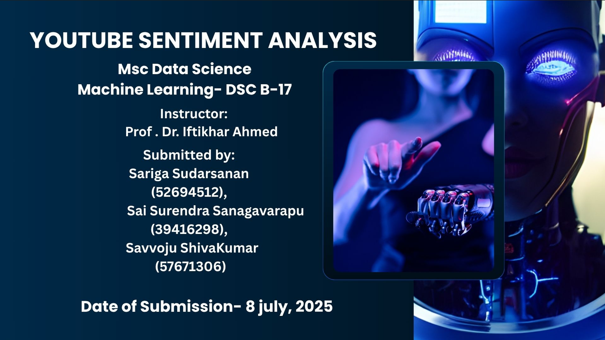

## 📝 Problem Statement

With the explosive growth of user-generated content on platforms like YouTube, analyzing comment sentiment is crucial for understanding audience feedback, improving content strategies, and detecting potentially harmful or toxic messages.

This project builds, evaluates, and compares multiple models — **Random Forest**, **Support Vector Machine (SVM)**, and a **Convolutional Neural Network (CNN)** — to automatically classify YouTube comments as **Positive**, **Negative**, or **Neutral**.

## 🎯 Objectives

- Build and compare multiple machine learning and deep learning models for sentiment classification.
- Evaluate each model's performance using accuracy, confusion matrix, and classification report.
- Provide an interface for users to input custom comments and predict sentiment.
- Visualize and compare results across models.

## ⚙️ Pipeline Overview

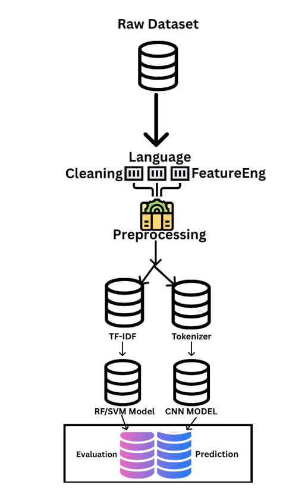

## ⚙️ How It Works

1. **Data Loading & Inspection** — Load a labeled CSV dataset of YouTube comments.
2. **Cleaning & Preprocessing** — Lowercase text, strip URLs/punctuation, encode sentiment labels, and engineer features (word count, character count, emoji count).
3. **Exploratory Data Analysis** — Visualize sentiment class distribution and word count patterns; filter to English-only comments using language detection.
4. **Feature Extraction** — TF-IDF vectorization for classical models; tokenization + padding for the CNN.
5. **Model Training & Tuning**
   - **Random Forest** — baseline model, then optimized via `GridSearchCV`.
   - **SVM** — linear-kernel baseline, then tuned across kernel/C/gamma.
   - **CNN** — Embedding → Conv1D → GlobalMaxPooling → Dense architecture, baseline and tuned versions.
6. **Evaluation** — Classification reports, confusion matrices, and ROC/AUC curves for each model.
7. **Model Comparison** — Bar chart comparing final accuracy across Random Forest, SVM, and CNN.
8. **Prediction Interface** — Accepts a custom user-typed comment and predicts its sentiment.

## 📊 Key Findings

- **Random Forest** and **SVM** provide solid baseline performance but treat words independently, ignoring order and context.
- **CNN** outperforms both traditional models by capturing word order and contextual meaning, resulting in higher accuracy and better generalization.

## 🛠️ Tools & Libraries

- **Data handling:** pandas, numpy
- **Visualization:** matplotlib, seaborn
- **Classical ML:** scikit-learn (RandomForestClassifier, SVC, TF-IDF, GridSearchCV)
- **Deep Learning:** TensorFlow / Keras (Embedding, Conv1D, GlobalMaxPooling1D)
- **NLP utilities:** langdetect, emoji, re

## 📊 Results

### Exploratory Data Analysis

| Sentiment Distribution | Word Count by Sentiment |
|---|---|
| 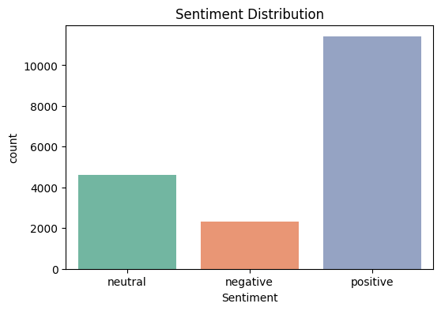 | 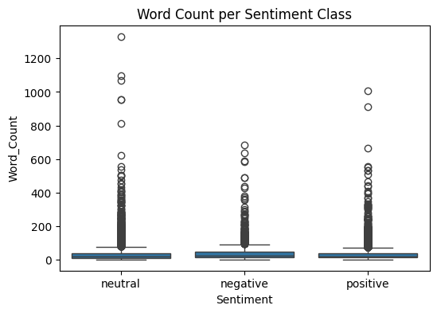 |

### Random Forest

| Confusion Matrix | ROC Curve |
|---|---|
| 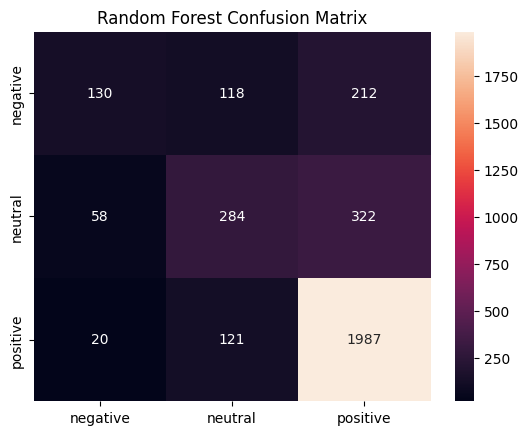 | 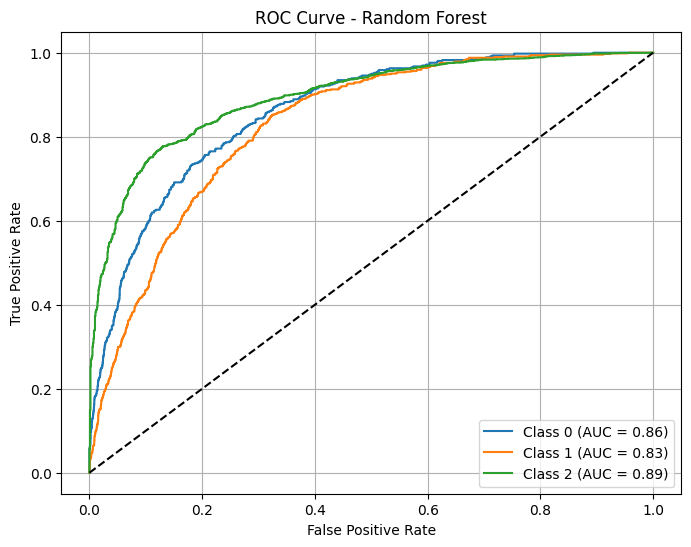 |

### SVM

| Confusion Matrix | ROC Curve |
|---|---|
| 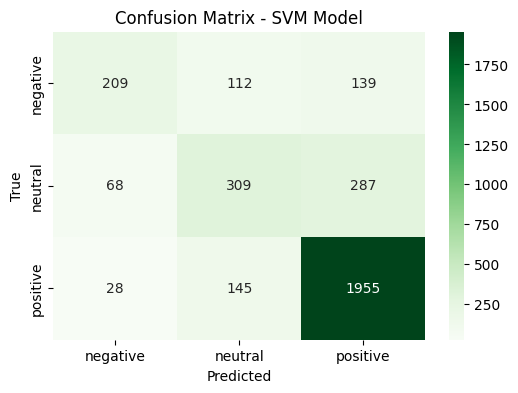 | 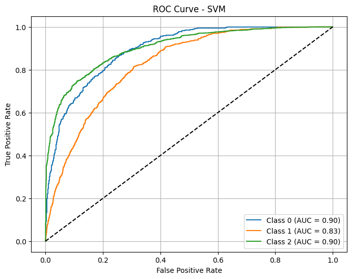 |

### CNN

| Confusion Matrix | ROC Curve |
|---|---|
| 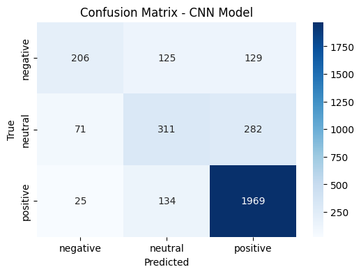 | 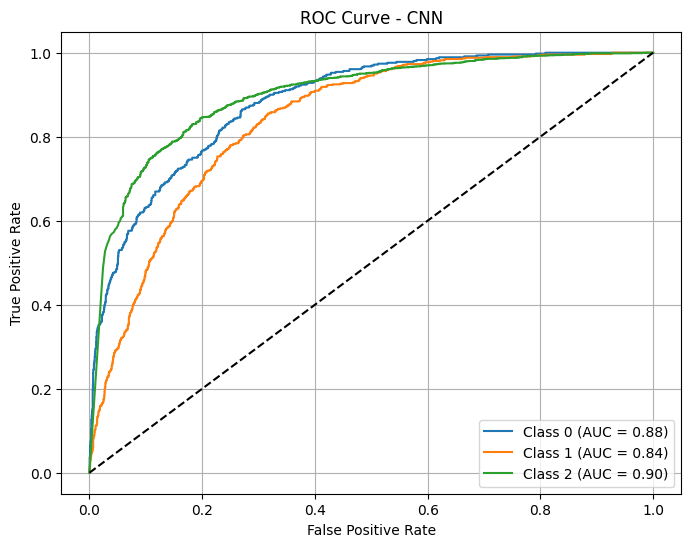 |

### Model Comparison

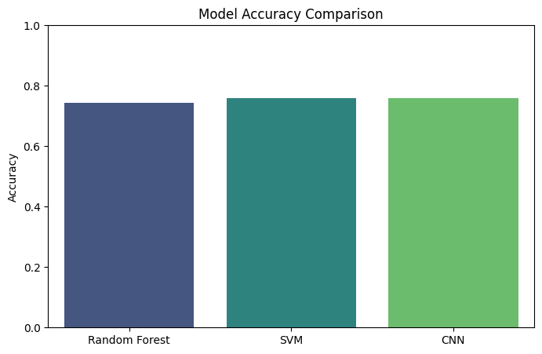

## 📁 Repository Structure

```
youtube-comment-sentiment-analysis/
├── Utube_Comment_Analysis_ipynb.ipynb   # Main analysis notebook
├── data/
│   └── YoutubeCommentsDataSet.csv       # Labeled comment dataset
├── images/
│   ├── title_slide.png
│   ├── pipeline_diagram.png
│   ├── sentiment_distribution.png
│   ├── word_count_by_sentiment.png
│   ├── confusion_matrix_random_forest.png
│   ├── roc_curve_random_forest.png
│   ├── confusion_matrix_svm.png
│   ├── roc_curve_svm.png
│   ├── confusion_matrix_cnn.png
│   ├── roc_curve_cnn.png
│   └── model_accuracy_comparison.png
├── README.md
├── LICENSE
└── .gitignore
```

## 🚀 Running the Notebook

This notebook was built in Google Colab and expects a CSV dataset (`YoutubeCommentsDataSet.csv`) with `Comment` and `Sentiment` columns.

1. Open the notebook in [Google Colab](https://colab.research.google.com/).
2. Upload `data/YoutubeCommentsDataSet.csv` to the Colab session as `/content/YoutubeCommentsDataSet.csv` (or update the path in the notebook to point at `data/YoutubeCommentsDataSet.csv` if running locally).
3. Run all cells in order.
4. Use the final prediction cell to test custom comments against the trained models.

## 📄 License

This project is licensed under the [MIT License](LICENSE).

## ✅ Conclusion

This project demonstrates that deep learning models (CNN) generally outperform classical ML approaches (Random Forest, SVM) for text sentiment classification, since they can learn word order and contextual meaning rather than treating text as a simple bag of words.
